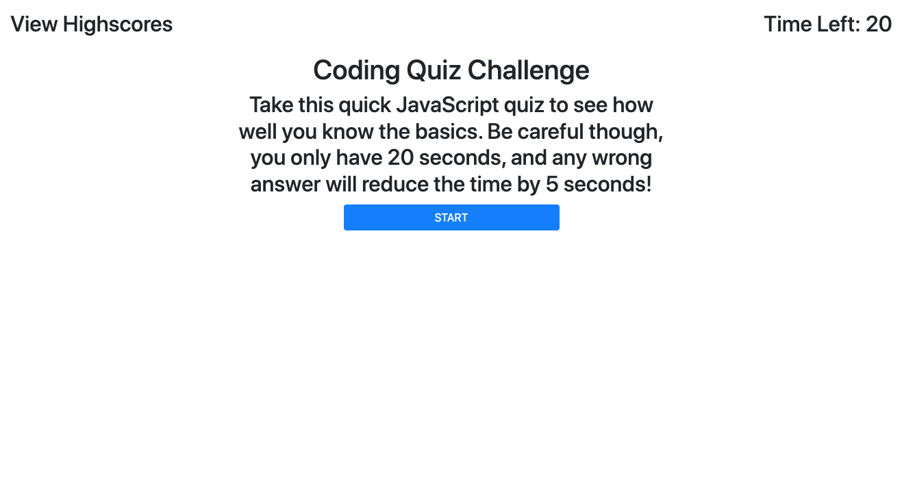

# 04 Web APIs: Code Quiz
## Put your JavaScript skills to the test!.. er quiz.

This code quiz is equiped with:

```
1. A timer that counts down from 20 once the start button is clicked.
2. Four questions that cycle to the next when an answer is selected.
3. A five second time penalty for incorrect selections
4. A score counter that goes up when a coorect answer is selected
5. A "Game Over" mechanic that ends the game if all questions are answered or if time runs out.
6. The ability to enter your initials and save your score when the quiz is over.
```

## Mock-Up:



## Links:

Github repository link: https://github.com/BryanBorek/04-Code-Quiz

Link to deployed site: https://bryanborek.github.io/04-Code-Quiz/

---
"This project was so intense, but so rewarding" - Bryan Borek 2022 